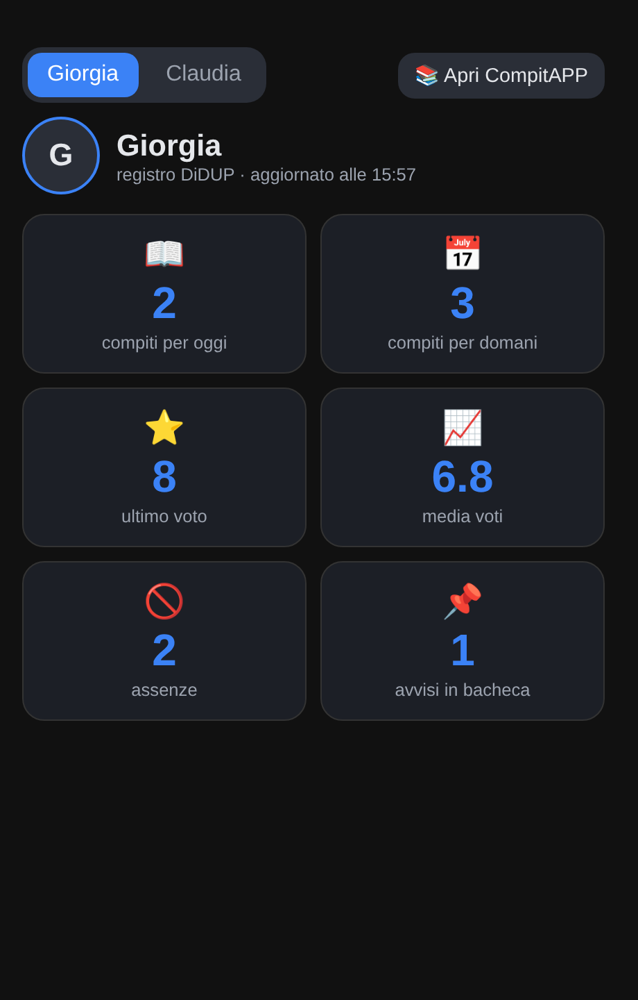
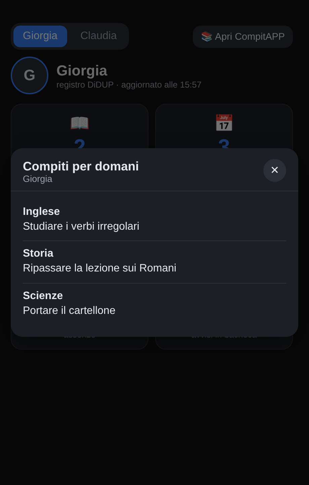
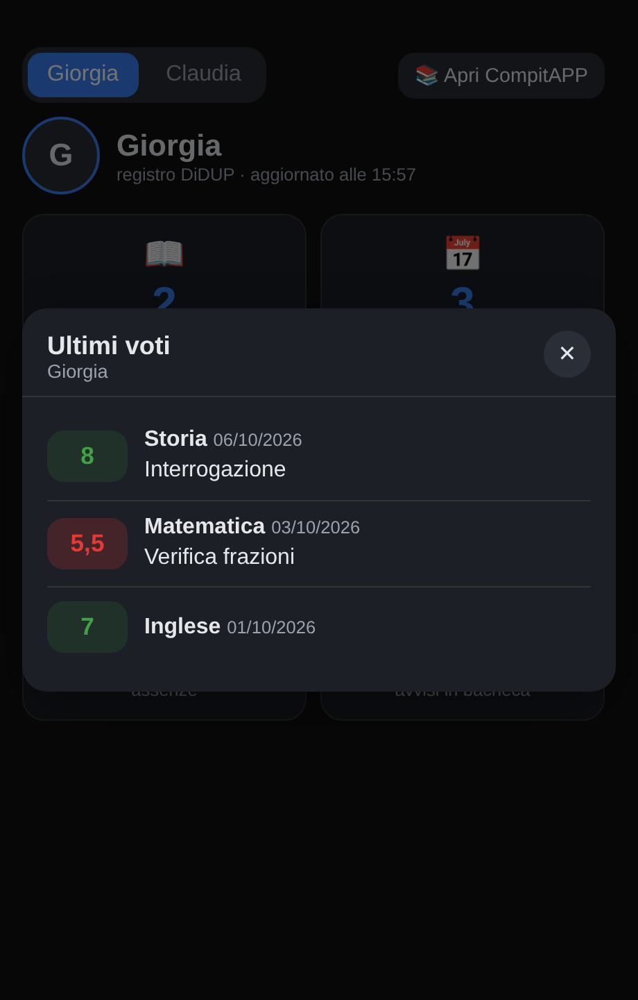

# 📚 CompitAPP — App per Home Assistant

<div align="center">


**Compiti, voti e comunicazioni del registro scolastico DiDUP/Argo ScuolaNext,**
**direttamente su Telegram e in una comoda pagina web — dentro il tuo Home Assistant.**

[](https://my.home-assistant.io/redirect/supervisor_add_addon_repository/?repository_url=https%3A%2F%2Fgithub.com%2Felbarto8383%2FCompitAPP)

**Ti è utile? Offrimi un caffè ☕**

[](https://paypal.me/elbarto83)

[](https://www.home-assistant.io/)
[](https://python.org)
[](LICENSE)

</div>

> ℹ️ In Home Assistant gli *add-on* si chiamano ora **«app»**: in questo documento i due termini indicano la stessa cosa.

> ⚠️ **Progetto non ufficiale.** CompitAPP non è affiliato né approvato da Argo Software S.r.l. Argo, DidUP e ScuolaNext sono marchi dei rispettivi proprietari. Leggi la sezione [Avvertenze](#️-avvertenze-importanti) prima di usarlo.

---

## 💡 Perché esiste

Aprire l'app del registro più volte al giorno per controllare se ci sono novità è scomodo, e capita di accorgersi dei compiti all'ultimo momento.

CompitAPP controlla il registro al posto tuo e **ti avvisa su Telegram**: nuovi compiti, voti, assenze, comunicazioni della scuola e un riepilogo serale di quello che c'è da fare per domani. Entrambi i genitori (e, se vuoi, anche il ragazzo, che non vede mai i voti) restano informati senza aprire niente.

Essendo dentro Home Assistant, i dati diventano anche **sensori** (compiti di oggi e di domani, ultimo voto, media, assenze) che puoi mostrare in una dashboard o usare nelle automazioni, e c'è una pagina web con tutto il registro, l'orario ricostruito e più figli in un colpo d'occhio.

> Nella nostra esperienza, con le stesse credenziali sull'app DiDUP l'accesso di un secondo genitore può disconnettere il primo. Con CompitAPP entrambi ricevono le stesse informazioni senza usare l'app. Potrebbe dipendere dalla scuola: non è detto che succeda a tutti.

---

## ✨ Funzionalità

### 🧭 In sintesi

- 📱 **Pagina web** per compiti, calendario, voti, orario, bacheca, assenze e lezioni, dentro Home Assistant e usabile anche da telefono
- 🤖 **Bot Telegram** con comandi e **notifiche automatiche** (compiti, voti, assenze, bacheca, note)
- 🌙 **Riepilogo serale** intelligente e personalizzabile
- 👨‍👩‍👧‍👦 **Più figli**, anche con lo stesso account DiDUP, ognuno con le sue notifiche
- 🏠 **Sensori** per automazioni e dashboard
- 🃏 **Card per la dashboard** con popup di dettaglio (novità 2.0)

### 📱 Pagina web (PWA) — usabile da browser, iPhone e Android

| Scheda | Contenuto |
|---|---|
| 🏠 **Oggi** | Compiti di oggi, domani, prossimi giorni + ultimi voti |
| 📅 **Calendario** | Tutti i compiti passati e futuri |
| 📊 **Voti** | Tutti i voti con media per materia |
| 🗓️ **Orario** | Orario settimanale colorato per materia (si aggiorna da solo, vedi sotto) |
| 📢 **Bacheca** | Comunicazioni e circolari della scuola |
| 🏠 **Assenze** | Assenze, ritardi e uscite anticipate con statistiche |
| 📖 **Lezioni** | Argomenti svolti in classe negli ultimi 30 giorni |
| ⚙️ **Config** | Stato della connessione, destinatari Telegram, impostazioni |

### 🤖 Bot Telegram

I comandi vengono registrati **automaticamente** all'avvio, senza passare da @BotFather.

| Comando | Descrizione |
|---|---|
| `/start` | Benvenuto e Chat ID |
| `/chatid` | Mostra il tuo Chat ID |
| `/resoconto` | Riepilogo di compiti e voti |
| `/orario` | Orario di oggi |
| `/orario lunedi` | Orario di un giorno (lun/mar/mer/gio/ven, e sab se c'è scuola) |
| `/voti` | Ultimi voti e media per materia |
| `/help` | Elenco dei comandi |

### 🔔 Notifiche automatiche

| Evento | Genitori | Studente |
|---|---|---|
| 📚 Nuovo compito | ✅ | ✅ |
| 🌙 Riepilogo serale dei compiti | ✅ | ✅ |
| ⭐ Nuovo voto | ✅ (🟢🟡🔴) | ❌ |
| 🏠 Assenza/Ritardo | ✅ | ❌ |
| 📢 Comunicazione in bacheca | ✅ | ✅ |
| 📋 Promemoria docente | ✅ | ✅ |
| ⚠️ Nota disciplinare | ✅ | ❌ |

- **Genitori**: ricevono tutto. **Studente** (facoltativo): solo compiti e riepilogo, mai voti, assenze o note.
- **Più figli**: puoi aggiungere più studenti, ognuno con le proprie notifiche e i propri sensori.

### 🌙 Riepilogo serale intelligente e personalizzabile

Ogni sera all'orario scelto arriva il riepilogo dei compiti per il giorno dopo.

- **Modalità `auto`** (predefinita): se domani non è giorno di scuola e non ci sono compiti, il messaggio non viene inviato (niente "nessun compito per domani" il sabato sera). I giorni di scuola sono riconosciuti dalle lezioni del registro, quindi chi ha scuola anche il sabato continua a riceverlo. Se ci sono compiti, il riepilogo parte sempre.
- **Personalizzabile**: modalità (`auto` / `sempre` / `solo_con_compiti`), orario di invio, orario di domani nel messaggio, frasi tue per "nessun compito" e per la chiusura.

### 🗓️ Come funziona l'orario

Argo non rende disponibile l'orario settimanale in modo diretto. CompitAPP lo **ricostruisce dalle lezioni registrate** (giorno, ora, materia, docente): CompitAPP legge dal registro lo storico delle lezioni (dall'inizio della scuola, al primo avvio) e le conserva: l'orario è completo subito, poi si aggiorna da solo se la scuola lo cambia. Se un docente non annota una lezione, quell'ora può risultare mancante finché non compare nel registro.

### 🏠 Sensori Home Assistant

Per ogni studente vengono creati automaticamente (il nome è scritto in minuscolo, con `_` al posto degli spazi: "Luigi Rossi" → `luigi_rossi`):

| Sensore | Valore | Contenuto dell'attributo |
|---|---|---|
| `sensor.compitapp_<nome>_compiti_oggi` | numero di compiti | `elenco`: materia e testo di ogni compito |
| `sensor.compitapp_<nome>_compiti_domani` | numero di compiti | `elenco`: materia e testo |
| `sensor.compitapp_<nome>_ultimo_voto` | ultimo voto | `elenco`: ultimi 15 voti (data, materia, voto, commento) |
| `sensor.compitapp_<nome>_media_voti` | media generale | `medie`: media e numero di voti per materia |
| `sensor.compitapp_<nome>_assenze` | totale assenze | `elenco`: assenze, ritardi, uscite (data, tipo, giustificata) |
| `sensor.compitapp_<nome>_bacheca` | avvisi degli ultimi 30 giorni | `elenco`: ultime comunicazioni (titolo, mittente, testo) |

I sensori si aggiornano a ogni controllo del registro, quindi puoi usarli in automazioni, notifiche e dashboard come qualsiasi altro sensore.

### 🃏 Card per la dashboard (novità 2.0)

CompitAPP include una **card per Home Assistant** pronta all'uso, senza installare nulla da HACS: sei tessere (compiti di oggi e domani, ultimo voto, media, assenze, bacheca) e, **toccando una tessera, si apre un popup con il dettaglio** (i compiti da fare materia per materia, i voti con commento, la media per materia, le assenze da giustificare, le comunicazioni).

<div align="center">



</div>

#### Come installarla (3 passaggi, una sola volta)

1. **Aggiorna CompitAPP alla 2.0 e riavvialo.** All'avvio l'app copia da sola la card nella cartella `www` di Home Assistant (nei registri trovi la riga `[CARD] ✅ Card installata`).
2. Vai su **Impostazioni → Dashboard → ⋮ (in alto a destra) → Risorse** → **Aggiungi risorsa**:
   - URL: `/local/compitapp/compitapp-card.js`
   - Tipo: **Modulo JavaScript**

   *Non vedi «Risorse»?* Attiva la **modalità avanzata** nel tuo profilo utente (clicca il tuo nome in basso a sinistra → «Modalità avanzata»). Se `www` non esisteva già, riavvia Home Assistant una volta.
3. Modifica la dashboard → **Aggiungi card → Manuale** e incolla:

```yaml
type: custom:compitapp-card
students:
  - name: Giorgia          # esattamente il nome scritto in CompitAPP (maiuscole non importanti)
    photo: /local/giorgia.jpg   # facoltativo
  - name: Claudia
open_url: /hassio/ingress/compitapp   # facoltativo: aggiunge il bottone "Apri CompitAPP"
```

Con **più figli** compaiono i pulsanti per passare dall'uno all'altro. Con **un solo figlio** puoi scrivere più semplicemente:

```yaml
type: custom:compitapp-card
student: Luca Rossi
```

Per mostrare la foto copia l'immagine nella cartella `www` di Home Assistant (ad esempio con l'app *File editor* o *Samba*): sarà raggiungibile come `/local/nome-file.jpg`. L'indirizzo per `open_url` lo vedi aprendo CompitAPP dalla barra laterale (di solito `/hassio/ingress/` seguito dallo *slug* dell'app).

> La card usa i colori del tuo tema (chiaro o scuro) e si adatta al telefono. Se preferisci creare la tua, tutti i dati sono nei sensori qui sopra: ad esempio con `custom:button-card` e `browser_mod` puoi aprire un popup personalizzato leggendo l'attributo `elenco`.

#### Esempi di automazioni con i sensori

```yaml
# Avviso in casa quando ci sono compiti per domani
trigger:
  - platform: numeric_state
    entity_id: sensor.compitapp_giorgia_compiti_domani
    above: 0
```

```yaml
# Elenco dei compiti in una notifica o su un display
message: >
  
  • {{ c.materia }}: {{ c.testo }}
  
```

## 📸 Screenshot

<div align="center">


</div>

<sub>Screenshot con dati di fantasia.</sub>

---

## 🚀 Installazione

### Metodo 1 — Da repository GitHub (consigliato)

Clicca il pulsante **Aggiungi a Home Assistant** in alto, oppure:

1. In Home Assistant vai su **Impostazioni → Add-on → Store**
2. Tre puntini in alto a destra → **Repository**
3. Inserisci l'URL: `https://github.com/elbarto8383/CompitAPP`
4. Cerca **CompitAPP** nello store e premi **Installa**
5. Compila la **Configurazione** e premi **Salva** → **Avvia**

> Serve Home Assistant OS o Supervised (quelli con lo store di add-on). Non è disponibile con Home Assistant Container o Core.

### Metodo 2 — Installazione locale via Samba

1. Accedi alla cartella `addons` di Home Assistant via Samba
2. Crea la cartella `compitapp` e copia dentro i file della cartella `compitapp/` di questo repository
3. In HA: **Impostazioni → Add-on → Store → Ricarica**, poi installa CompitAPP

### Aggiornamenti

Nello store premi i tre puntini → **Verifica la presenza di aggiornamenti**: quando esce una nuova versione compare il pulsante **Aggiorna**. Le novità sono in [CHANGELOG](compitapp/CHANGELOG.md).

---

## ⚙️ Configurazione

Da **Impostazioni → Add-on → CompitAPP → Configurazione**:

```yaml
# Token del bot Telegram (lo crei con @BotFather)
telegram_token: "123456:ABC-DEF..."   # campo oscurato

# Genitore 1 (obbligatorio)
genitore1_nome: "Mario"
genitore1_chat_id: ""

# Genitore 2 (facoltativo)
genitore2_nome: "Lucia"
genitore2_chat_id: ""

# Studente singolo (facoltativo, vecchio metodo: vale solo se hai UN figlio).
# Con più figli usa il campo `chat_id` dentro ogni studente (vedi sotto).
studente_nome: "Luca"
studente_chat_id: ""

# Notifiche
soglia_voto_alert: 7              # voto sotto cui scatta l'avviso
orario_reminder_sera: "20:00"     # ora del riepilogo serale (dopo la modifica riavvia l'add-on)
reminder_modalita: "auto"         # auto | sempre | solo_con_compiti
reminder_mostra_orario: false     # true = aggiunge l'orario di domani
reminder_testo_vuoto: ""          # frase tua per "nessun compito" (vuoto = predefinita)
reminder_testo_chiusura: ""       # frase tua a fine messaggio (vuoto = predefinita)
polling_intervallo_minuti: 30     # ogni quanto controlla il registro

# Studenti (uno o più figli)
studenti:
  - nome: "Luca Rossi"
    codice_scuola: "SC12345"      # codice scuola (dalla segreteria o dall'app DiDUP)
    username: "l.rossi"           # username DiDUP
    password: "la_tua_password"
    alunno:                       # SOLO se un account DiDUP ha più figli (vedi sotto)
    chat_id: ""                   # facoltativo: Chat ID Telegram di questo ragazzo/a
                                  # (riceve compiti, riepilogo, bacheca e promemoria; mai i voti)
```

Con più figli aggiungi una voce per ciascuno, ognuno con il proprio `chat_id`: ogni ragazzo riceve solo le sue notifiche.

**Due figli con lo stesso account DiDUP?** Se la scuola ti ha dato un solo accesso che mostra entrambi i figli, crea due voci con le stesse credenziali e nel campo `alunno` scrivi `1` per il primo figlio e `2` per il secondo (nello stesso ordine in cui li vedi nell'app DiDUP). Senza questo campo i dati dei due figli si mescolerebbero. Se i due risultano scambiati, inverti i numeri.

```yaml
studenti:
  - nome: "Giorgia"
    codice_scuola: "SC12345"
    username: "famiglia.rossi"
    password: "la_tua_password"
    alunno: 1
  - nome: "Luca"
    codice_scuola: "SC12345"
    username: "famiglia.rossi"
    password: "la_tua_password"
    alunno: 2
```

> Il campo `anno_scolastico` presente nella configurazione non viene più usato: l'anno è calcolato in automatico.

### Come trovare il tuo Chat ID Telegram
1. Cerca su Telegram il bot che hai creato
2. Scrivigli `/start`
3. Risponde con il tuo **Chat ID**: copialo nel campo corrispondente

### Come trovare il codice scuola
Si trova nella schermata del profilo dell'app DiDUP (formato `SC12345`) o chiedendolo alla segreteria.

---

## 📡 Accesso alla pagina web

Dopo l'avvio CompitAPP compare nella **barra laterale di Home Assistant** (Ingress): non serve altro.

Per metterlo in una dashboard: **Aggiungi scheda → Pagina Web** con URL `/api/hassio_ingress/4016d9e7_compitapp/`.

> ⚠️ Non usare `http://IP:5002` nella dashboard: dall'esterno non funziona e dà errori di contenuto misto con HTTPS.

---

## 🔒 Sicurezza e privacy — cosa succede ai tuoi dati

- **Dove vengono salvati**: compiti, voti e assenze sono scaricati e archiviati **solo nel database locale del tuo Home Assistant**. L'autore del progetto non ha alcun server e non riceve nessun dato.
- **Cosa esce dalla tua rete**: il programma dialoga con i server di **Argo** (per leggere il registro) e di **Telegram** (per inviarti le notifiche). Le notifiche contengono i dati scolastici dei ragazzi e passano quindi dai server di Telegram: valuta se ti va bene prima di attivarle.
- **Credenziali**: username e password DiDUP restano nella configurazione di Home Assistant (la password non è cifrata nel file di configurazione, come per tutte le opzioni degli add-on). Il token Telegram è oscurato nell'interfaccia. Proteggi l'accesso al tuo Home Assistant e ai suoi backup.
- **Solo lettura**: CompitAPP usa solo chiamate di lettura verso il registro: non inserisce né modifica dati e non giustifica assenze.
- **Accesso alla pagina**: passa dall'Ingress di Home Assistant (autenticazione di HA, nessuna porta esposta per l'interfaccia). La porta 5002 è comunque pubblicata sulla tua rete locale: non aprirla verso Internet.

---

## ⚠️ Avvertenze importanti

- **Uso non ufficiale.** Per quanto ne sappiamo Argo non offre un'interfaccia pubblica e documentata per le famiglie: CompitAPP usa la stessa via di accesso dell'app ufficiale tramite una libreria della comunità ([argofamiglia](https://pypi.org/project/argofamiglia/)). Argo può modificarla in qualsiasi momento e **il programma potrebbe smettere di funzionare senza preavviso**.
- **Condizioni d'uso.** Le credenziali sono personali: usa **solo le tue**, quelle che la scuola ti ha dato, e solo per il tuo account. Non sappiamo come Argo o la tua scuola considerino l'accesso da programmi di terze parti: leggi le condizioni che hai accettato al primo accesso e, nel dubbio, chiedi alla segreteria. **Lo usi a tua responsabilità.**
- **Dati di minori.** Il programma tratta dati scolastici dei tuoi figli, per uso personale e familiare. Non condividere schermate, token o credenziali in pubblico (nemmeno nelle issue).
- **Nessuna garanzia.** Il software è fornito «così com'è», senza garanzie (vedi [LICENSE](LICENSE)). Non sostituisce le comunicazioni ufficiali della scuola: per scadenze e avvisi importanti controlla anche il registro.
- **Una sola sessione.** Argo può consentire una sola sessione attiva per le stesse credenziali: se noti disconnessioni anomale dall'app dopo l'installazione, [apri una issue](https://github.com/elbarto8383/CompitAPP/issues) indicando cosa è successo.

---

## ❓ FAQ

**Il bot non risponde ai comandi**
→ Controlla che l'add-on sia avviato e il token corretto; prova a riavviarlo.

**Non vedo i compiti nella pagina web**
→ Premi 🔄 Sync in alto a destra: il primo sync può richiedere qualche secondo.

**L'orario è vuoto o incompleto**
→ Viene ricostruito dalle lezioni registrate dai docenti: servono alcuni giorni di scuola già annotati sul registro. Se un'ora manca, probabilmente il docente non l'ha ancora registrata.

**Posso usarlo con più figli?**
→ Sì: aggiungi più voci in `studenti`. Ognuno ha sensori e notifiche propri. Se i figli hanno lo stesso account DiDUP usa il campo `alunno` (1, 2…): vedi [Configurazione](#️-configurazione).

**Voti e media sono sempre «N/D», le assenze a 0**
→ Alle elementari i voti spesso non si usano e le assenze si azzerano a fine anno: se il registro non li contiene, CompitAPP non può mostrarli. Nei registri dell'app compare quanti voti arrivano da Argo (`Voti Nome: N ricevuti da Argo`).

**La card non compare / dice «Custom element doesn't exist»**
→ Controlla di aver aggiunto la risorsa `/local/compitapp/compitapp-card.js` come *Modulo JavaScript*, di aver riavviato CompitAPP dopo l'aggiornamento e di aver ricaricato la pagina (Ctrl+F5, o svuota la cache dell'app su telefono).

**La card mostra «–» al posto dei numeri**
→ Il nome in `students` deve essere quello scritto in CompitAPP. Controlla in **Strumenti per sviluppatori → Stati** che esista `sensor.compitapp_<nome>_compiti_oggi`.

**Funziona con altri registri (Nuvola, Axios, ClasseViva…)?**
→ Per ora solo DiDUP/Argo: è l'unico che posso provare. L'idea di un sistema a «connettori» per altri registri è benvenuta: apri una issue o proponi una pull request.

**Lo studente riceve i voti?**
→ No: con `studente_chat_id` riceve solo compiti, riepilogo, bacheca e promemoria.

**Non ricevo le notifiche**
→ Verifica i `chat_id` nella configurazione e scrivi `/resoconto` al bot per provare.

**Non ricevo il riepilogo serale il sabato**
→ È voluto: in modalità `auto` non viene inviato se il giorno dopo non c'è scuola e non ci sono compiti. Per averlo sempre imposta `reminder_modalita: "sempre"`.

---

## 🛠️ Supporto e contributi

Bug e richieste: [Issue su GitHub](https://github.com/elbarto8383/CompitAPP/issues). I contributi sono benvenuti con una pull request. Prima di aprire una issue **togli** da log e schermate username, password, token e Chat ID.

---

<div align="center">

Fatto con ❤️ per i genitori italiani — by [@elbarto8383](https://github.com/elbarto8383)

</div>
